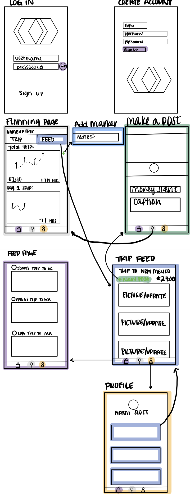

Original App Design Project - README
===

# 

## Table of Contents
1. [Overview](#Overview)
1. [Product Spec](#Product-Spec)
1. [Wireframes](#Wireframes)
2. [Schema](#Schema)

## Overview
### Description
App to allow users to plan, and track a road trip's: cost, photos, and progress.

### App Evaluation
[Evaluation of your app across the following attributes]
- **Category:** Travel assistant / traveling
- **Mobile:** Starting on Mobile
- **Story:** Allows user to plan and track a roadtrip with photos, and costs
- **Market:** Anyone who travels
- **Habit:** Update while traveling with photos and driving progress
- **Scope:** Use as a travel assistant and trave tool, with the ability to be expanded into a social app

## Product Spec

### 1. User Stories (Required and Optional)

**Required Must-have Stories**

* User can log in/ log out
* If user doesn't exist they can add a user
* User can make a road trip on a map by putting in an addresses - Google Maps SDK
* User can update progress when reaching a checkpoint on the map
* User can see other people's feed/trips
* Implement user profile
    * User information
    * User Trips
* User can add trip updates (Money spent, Photos, and journal entries) to their Trip's feed
* User can see current amount spent on trip
* User can see posted updates with trip progress


**Optional Nice-to-have Stories**

* User can add other users to the trip, and they can split everything evenly
* User can Change road trip/decide to end early, and recalculate rest of trip accordingly
* User can request a stop, and it will suggest popular food places near them
* Other users can add expenses, and calculate what everyone owes them
* When making map user can see projected cost of trip
* Can connect to Twitter, to attach all information into update for app
* User can connect road trip playlists/podcasts from Spotify for everyone to edit/contribute


### 2. Screen Archetypes

* Log-in/Create Account Screen
   * User can log into existing account
   
* Register Account Screen
   * User can create a new account

* Road Trip Screen
   * User can make a road trip on a map by putting in an addresses - Google Maps SDK
   * User can update progress when reaching a checkpoint on the map
   * User can Change road trip/decide to end early, and recalculate rest of trip accordingly

* Add Progress/Update
   * User can add trip updates (Prices/Money spent, Photos) to their Trip's feed

* Profile
   * Implement user profile
        * User information
        * User Trips
   * User can log out of account
   * User can export and send trip
 
* Trip Feed
   * User can see posted updates with trip progress
   * User can see current amount spent on trip

* Feed Page
   * User can see other people's feed/trips


### 3. Navigation

**Tab Navigation** (Tab to Screen)

* Road Trip Screen
* Trip Feed
* Profile

**Flow Navigation** (Screen to Screen)


* Log-in/Create Account Screen
    * Road Trip Screen
    
* Register Account Screen
    * Road Trip Screen

* Road Trip Screen
    * Add Progress/Update
    * Trip Feed

* Add Progress/Update
    * Road Trip Screen

* Profile
    * Trip Feed

* Trip Feed
    * Road Trip Screen

* Feed Page
   * Road Trip Screen
   * Profile


## Wireframes


### [BONUS] Digital Wireframes & Mockups

### [BONUS] Interactive Prototype

## Schema 
Post Model:
|Property	|Type	|Description|
|---------|-----|-----------|
|objectId	|String	|Unique Id for user’s post|
|createdAt	|DateTime	|Date when the post was created|
|image	|File	|Image the user posts|
|caption	|String	|Image caption by author|
|TripId	|Pointer to Trip	|Trip where user posted|
|caption	|String	|Post Caption|
|location	|String	|Name of location where the post was made|
|lat	|Double	|Latitude where post was created|
|lng	|Double	|Longitude where post was created|

Trip Model:
|Property	|Type	|description|
|---------|-----|-----------|
|TripId	|String	|Unique for every trip|
|author	|Pointer to User	|Author of the Trip|
|tripLength	|Double	|Time of the total trip|
|cost	|Double	|Total amount of money spent on trip so far|

Locations Model:
|Property	|Type	|description|
|---------|-----|-----------|
|TripId	|Pointer to Trip	|Pointer to the trip that included this location|
|Lat	|Double	|Latitude of the location |
|Lng	|Double	|Longitude of the location|
|Name	|String	|Name of the location|


* Home Feed Screen
    * (Read/GET) Query all posts
* Make Post/ Update
    * (Create/POST) Create a new post object
    * (Update/PUT) Update total money spent on trip
* Profile Screen
    * (Read/GET) Query logged in user’s Trips
    * (Read/GET) Query logged in user
    * (Delete) Delete existing trip
* Create Road Trip Screen
    * (Create/POST) Create a Map through google maps
    * (Read/GET) Query logged in user’s current trip to populate map
    * (Update/PUT) Update user’s trip with added markers
    * (Delete) Delete existing marker on map
* Trip Feed Page
    * (Read/GET) Query clicked Trip’s Posts


Profile Screen:
```
{
// specify what type of data we want to query - Post.class
ParseQuery<Trip> query = ParseQuery.getQuery(Trip.class);
// include data referred by user key
query.include(Post.KEY_USER);
//only query posts of the currently signed in user
query.whereEqualTo(Trip.KEY_USER, ParseUser.getCurrentUser());
// order posts by creation date (newest first)
query.addDescendingOrder("createdAt");
query.findInBackground(new FindCallback<Post>() {
      @Override
      public void done(List<Post> posts, ParseException e) {
          // check for errors
          if (e != null) {
                Log.e(TAG, "Issue with getting posts", e);
                return;
           }
           for (Post post : posts) {
               Log.i(TAG, "Trip: " + trip.getDescription() + ", username: " + trip.getUser().getUsername());
           }
}
```

Home Feed Screen:
```
{
// specify what type of data we want to query - Post.class
ParseQuery<Post> query = ParseQuery.getQuery(Post.class);
// include data referred by user key
query.include(Post.KEY_USER);
// order posts by creation date (newest first)
query.addDescendingOrder("createdAt");
query.findInBackground(new FindCallback<Post>() {
      @Override
      public void done(List<Post> posts, ParseException e) {
          // check for errors
          if (e != null) {
                Log.e(TAG, "Issue with getting posts", e);
                return;
           }
           for (Post post : posts) {
               Log.i(TAG, "Post: " + post.getDescription() + ", username: " + post.getUser().getUsername());
           }
}
```

### Models
[Add table of models]
### Networking
- [Add list of network requests by screen ]
- [Create basic snippets for each Parse network request]
- [OPTIONAL: List endpoints if using existing API such as Yelp]
